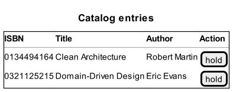

Challenge: Java, 2023(a), senior-level
---

_Update_: Please note that [a solution](./solution.md) is available for this chalenge. 

This GitHub repository contains the instructions for a challenge to be submitted by candidats for a senior-level Java
developer/analyst position at the University of Lausanne (DSM-DEV-INT division).

If you are reading this, it means that you have been contacted personally by a member of DSM-DEV-INT team with specific
instructions of how to submit your solution.

This edition of the challenge first appeared for a job posted in the years 2023.

#### Pre-requisits and preliminary reading

In order to complete the challenge you just need:
- JDK v. 17 ([Temurin edition](https://adoptium.net/temurin/releases/), for example)
- Maven v. 3.5.3 or later
- IDE of your choice (IntelliJ is strongly recommended for its outstanding refactoring capabilities)
- Docker runtime (for running Postgres DB provisioned from `docker-compose.yaml` file in the source repository)

Please, refresh your memory concerning the concepts related to Hexagonal and Clean Architecture. Here is a list of most
important sources to consult:
- [The Clean Architecture](https://blog.cleancoder.com/uncle-bob/2012/08/13/the-clean-architecture.html), by Robert C. Martin
- [DDD, Hexagonal, Onion, Clean, CQRS, … How I put it all together](https://herbertograca.com/2017/11/16/explicit-architecture-01-ddd-hexagonal-onion-clean-cqrs-how-i-put-it-all-together/), by Herberto Graça

This challenge consists of three parts:

#### Part one, reading

In addition to the reading list mentioned above, please, familiarize yourself with these three articles from our blog.

- [Flow of control in Clean Architecture](https://medium.com/unil-ci-software-engineering/flow-of-control-in-clean-architecture-23662dfd24f7)
- [Separation of Concerns between Use Cases and Entities](https://medium.com/unil-ci-software-engineering/separation-of-concern-between-use-cases-and-entities-e3a86cdee49e)
- [Hand-Crafted Persistence for Clean Architecture](https://medium.com/unil-ci-software-engineering/hand-crafted-persistence-for-clean-architecture-3fe46cbef531)

You are more than welcome to consult any other articles you may wish and to explore any source code publicly available.

#### Part two, implementation

In the part one, you have seen our implementation of Library domain, available at 
[gushakov/library-clean](https://github.com/gushakov/library-clean) GitHub repository. Please, make **a private clone**
(do not fork) of this repository for your personal GitHub user.

As you have noticed, this implementation uses principles of DDD and Clean Architecture. It is not a complete 
implementation. Only a single use case has been dealt with as an illustration. It is a use case of a patron placing a
hold on a book. For this use case the models, the use case itself, and the persistence have been implemented and tested.

Your task is to implement the UI for just _this single use case_. Here is how we imagine the interface:

1. Patron logs in to an application, say `patron1` with password `secret4p1`.
2. Patron is presented with a simple table of ISBN entries from the library catalog. Like this one:

3. Patron can proceed to place a hold on any of the catalog entries (say on "Domain-Driven Design"). The UI should
reflect that a new hold has been placed by updating a list of the patron's current holds.

4. If a patron tries to place a hold on an entry which she already currently holds, an error message must be displayed.

To realise this task, please use either one of these UI frameworks:

- [ZK framework](https://www.zkoss.org/) (if you are familiar with it)
- Thymeleaf

You can use any of Spring Boot compatible libraries and/or starters you find useful to you (Spring Security,
ZK Spring Boot, etc.). 
Do not worry about graphical aspect (login screen, grid, etc.) of your UI we are only interested in the functional and 
architectural aspects of your solution. Hint: there are many resources on our blog which can help you with this task.

#### Part three, discussion

Please, answer the following questions using a file `discussion.md` added at the root of your working copy of 
[gushakov/library-clean](https://github.com/gushakov/library-clean) repository. Be as specific as you want to be.

Describe your solution in terms of Clean Architecture principles. Which components and from which layer you had to 
implement? What was the most challenging part of the implementation? Compare and contrast the overall implementation
presented here to [the original implementation](https://github.com/ddd-by-examples/library). What are the strengths 
and weaknesses of Use Case driven architecture in your opinion?

#### Conclusion

It would be nice if you manage to submit a working solution. But if you are stuck or running short on time, we would
appreciate some pseudocode and your comments for the part three (above). For an experienced Java developer familiar with
one of the listed UI frameworks, the solution should take 2-3 days including the required research.

We thank you for your feedback and your interest in the position here at the university. We wish you best of luck.

